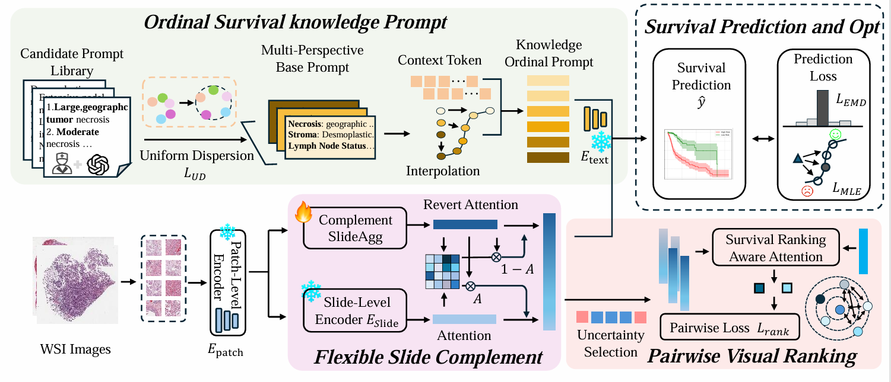

<div align="center">
<h1>MPRSurv: Multi-Perspective Prompted Ranking for Vision-Language Survival Analysis on Whole Slide Images</h1>
</div>

This repository is the official implementation of **MPRSurv**.

## Table of Contents
- [Overview](#overview)
- [Data Preparation](#data-preparation)
- [Training Models](#training-models)

## Overview



**Abstract:** Vision-language models (VLMs) have emerged as a promising approach for survival analysis in digital pathology, effectively bridging the semantic gap between histological features and clinical outcomes. However, current approaches face significant challenges: (1) generic survival prompts that fail to capture diverse pathological perspectives; (2) limited transferability of pretrained foundational models to survival tasks due to weak supervision and small, highly heterogeneous datasets; and (3) insufficient guidance for capturing complex inter-patient relationships in survival time variations. To address these challenges, we propose MPRSurv, which leverages multi-perspective prompts to adapt VLMs for survival ranking tasks. First, we design multi-perspective prompts that construct diverse survival templates from clinical viewpoints and select optimal combinations maximizing inter-class dispersion. Second, we introduce a flexible slide-level complementary learning module with a reverse-attention mechanism that enables lightweight adaptation of pretrained VLM encoders to capture dataset-specific features not represented in foundation models. Third, we develop a pairwise visual ranking method with uncertainty-aware sample selection that directly guides VLM visual encoders toward learning survival ranking-aware representations under weak supervision. Our multi-perspective prompting unifies the framework by providing enriched supervision for both complementary learning and ranking guidance. Extensive evaluation on five TCGA datasets demonstrates that our framework significantly outperforms state-of-the-art methods under both full-sample and low-sample conditions for survival prediction.

## Data Preparation

### WSIs
We preprocess whole slide image (WSI) data using [TRIDENT](https://github.com/mahmoodlab/Trident), which provides an easy-to-use tool for WSI preprocessing. We use [TITAN](https://github.com/mahmoodlab/TITAN) as the patch-level feature encoder and store the extracted features in the `YOUR_PATH>/{0}/patch_features` directory.

### Text Prompt
We construct diverse, pathology-informed survival templates using both large language models (LLMs) and expert knowledge. The examples we use are provided in `PromptSelect/raw_matrix.json`. We employ inter-class feature dispersion via the Uniform Dispersion Loss as shown in `PromptSelect/select.py`, and ultimately generate the prompt templates in `prompt/survival_prompts_9.json`.

### Data Split
We use the same data tables as VLSA from [VLSA](https://github.com/liupei101/VLSA).

## Training Models 

Use the following command to load an experiment configuration and train the MPRSurv model (5-fold cross-validation) using the complete dataset:
```bash
python3 main.py --config config/blca.yaml --handler MPRSurv --multi_run
```
Use the following command to load an experiment configuration and train the MPRSurv model (5-fold cross-validation) using a subset of the dataset in a few-shot learning setting:
```bash
python3 main.py --config config/blca_fewshot.yaml --handler MPRSurv --multi_run
```

All important arguments are explained in `config/blca.yaml` and `config/blca_fewshot.yaml`.